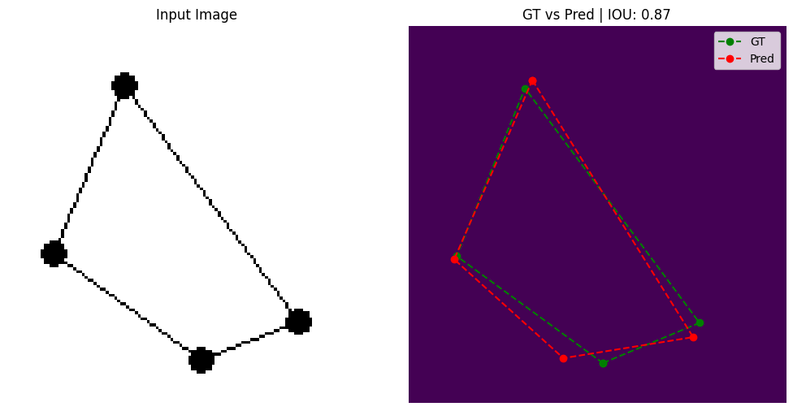
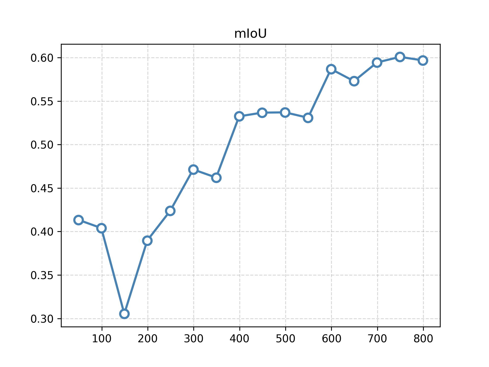

# README

## Setup for reproducing

```shell
uv sync
source .venv/bin/activate
```

### Task 1
```
python task1.py
```
### Task ML
```
cd task_ml
python task.py
```

Dear reviewer,

below is the architecure that i used to solve the task_ml for predicting polygon points.


---

Current results are as follows(best case and mean scores):
|  | |
|------------------------------------------------|-------------------------------------------------------|

## Future Improvements
Further mIOU can be improved by incorporating the pred_exists_head output information. Polygons points can be filtered such that
the number of points in the gt and predictions remain close, which would further improve the mIOU score.