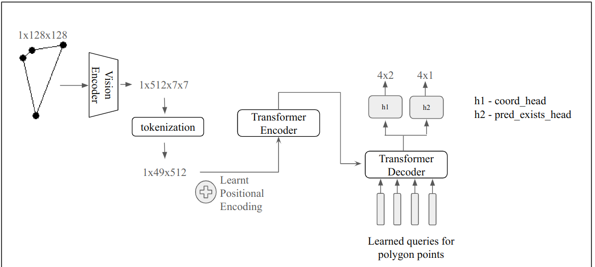

# README

## Setup for reproducing

```shell
uv sync
source .venv/bin/activate
```

### Task 1
```
python task1.py
```
### Task ML
```
cd task_ml
python task.py
```

Dear reviewer,

below is the architecure that i used to solve the task_ml for predicting polygon points.




---
